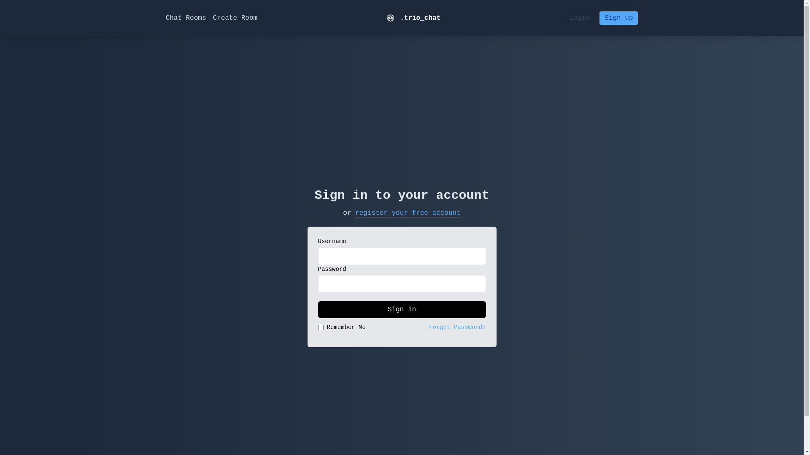
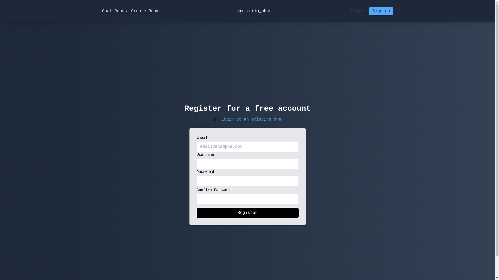
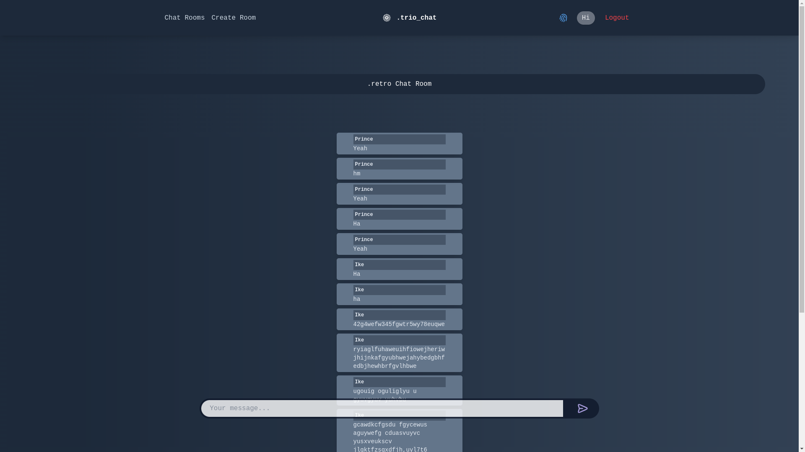

# trio-chat-application
Chat application built with Django to showcase the use of Django Channels.


# Overview/Result
Trio Chat Application is a Django-based chat platform utilizing Django Channels to enable real-time communication. This project serves as a learning example for implementing Django Channels in a chat application.

- Login Screen
  

- Chat Lobby
  

- Room with Messaging
  


## Table of Contents

- [Overview](#overview)
- [Features](#features)
- [Installation](#installation)
- [Usage](#usage)
- [Screenshots](#screenshots)
- [Contributing](#contributing)
- [License](#license)


## Features
- User authentication and login
- Chat lobby to join different chat rooms
- Real-time messaging within chat rooms
- Responsive and user-friendly design

## Installation

### Prerequisites
- Python (3.6 and above)
- Django (3.0 and above)

### Steps

1. Clone the repository: ```git clone https://github.com/your-username/trio-chat-application.git```
2. Navigate to the project directory: ```cd trio-chat-application```
3. Install dependencies: ```pip install -r requirements.txt```
3. Apply database migrations: ```python manage.py migrate```
4.Start the development server: ```python manage.py runserver```

Visit http://localhost:8000/ in your web browser.

Explore the chat application, create an account, and start chatting!

### License
This project is licensed under the MIT License.

